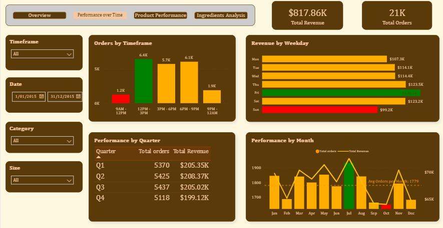

# 🍕 Pizza Sales Performance Analysis
## 📈 Power BI Report

[🔗 View Interactive Report on Power BI](https://app.powerbi.com/view?r=eyJrIjoiMDMxMjg1ZWUtNDk5ZS00NmE0LWEwMzgtNDExYWEzODAwOGU5IiwidCI6IjY0YTdjYjQ5LTNkOTYtNDI1Yy05ZjM3LTY4MDNkZTk0OWE5NCJ9&pageName=22f80e8912ee537dea52)

## 📊 Overview

This analysis aims to **identify key trends, patterns, and opportunities for improvement** across sales performance, customer behavior, and product categories.  
Insights derived from order data highlight **actionable strategies** to optimise marketing efforts, inventory management, and overall business performance.

---

## 👥 Customer & Order Insights

### 🔍 Key Findings
- **60% of all orders** consist of multiple pizzas, indicating that the majority of customers are **families or large groups**.  
- **Significant sales peaks** on **Thanksgiving and New Year’s Eve** suggest customers associate the brand with **social gatherings** and shared dining experiences.

### 💡 Recommendations
- Develop **family-oriented combo deals** featuring **3+ pizzas** with sides and beverages.  
- Pair **less popular pizzas** with high-performing ones in combo offers to **reduce inventory waste** and **boost turnover**.

---

## ⏰ Performance Over Time

### 🕛 Timeframe Analysis

#### Insights
- **12 PM–3 PM:** Peak sales from working professionals seeking lunch options.  
- **9 PM–12 AM:** Significant demand window suitable for **end-of-day promotions**.  
- **3 PM–6 PM:** Surprising popularity, showing demand for **afternoon snack options**.

#### Recommendations
- Offer **lunch specials** tailored to local demographics (e.g., vegan pizzas + salads near office districts).  
- Introduce **coffee offerings** for takeaway customers during lunch hours.  
- Maintain **adequate staffing** during late afternoons and promote **combo add-ons** such as fries, pizza wraps, and snacks.

---

### 📅 Monthly & Quarterly Trends

#### Insights
- **Summer months** show strong sales, suggesting the need for **seasonal staff hiring**.  
- **September–October dips** likely result from random off-days since **average daily revenue remains consistent**.

#### Recommendations
- Align **staffing and inventory** with seasonal demand.  
- Leverage **high-summer periods** through promotional campaigns to **maximise revenue capture**.

---

### 📆 Weekday Performance

#### Insights
- Sales remain steady, **peaking on Fridays** and **dipping on Sundays**.  
- The Friday spike, driven by **Classic Pizzas**, reflects customers seeking simple, familiar end-of-week options.  
- Lower Sunday revenue suggests a shift toward **home-prepared meals**.

#### Recommendations
- Introduce **premium spins on classic pizzas** (e.g., extra-pepperoni, four-cheese) to increase revenue.  
- Use **targeted Sunday promotions** to evoke a “home-style” experience — e.g., **BBQ or brisket pizzas**.  
- Implement **targeted marketing campaigns** that highlight comfort and family-oriented offerings.

---

## 🍽️ Product Performance Analysis

### 📏 Size-Based Analysis

#### Key Metrics
| Pizza Size | Revenue | Share of Total Sales | Key Insight |
|-------------|----------|----------------------|--------------|
| **Large**   | $375K    | 42%                  | Veggie pizzas dominate; strong interest in healthier options |
| **Medium**  | $249K    | 31%                    | Opportunity for meal combos for single customers |
| **Small**   | $178K    | 27%                    | Underperforming segment |
| **XL/XXL**  | ~$1K     | <1%                  | Significant untapped opportunity |

#### Recommendations
- Launch **social media campaigns** promoting XL/XXL pizzas for **parties and events**.  
- Offer **loyalty rewards** and **limited-time discounts** for large-size purchases.  
- Create **“Game Night” combo promotions** on Thursdays and Fridays.

---

### 🍕 Category & Product Analysis

#### Insights
- **Classic and Supreme Pizzas** remain the **top-performing categories**, followed by **Chicken and Veggie pizzas**.  
- Customer preferences are **consistent**, suggesting limited need for new innovation—focus on **optimising existing bestsellers**.  
- **Veggie pizzas** are gaining traction, reflecting a growing **health-conscious market**.  
- **Chicken pizzas** perform exceptionally well, offering **high profit margins** due to lower ingredient costs.

#### Recommendations
- Label bestsellers with a **“Most Loved by Customers”** tag to guide new buyers.  
- Maintain strong focus on **Classic and Supreme pizzas**, complemented by **traditional sides** (fries, wings, mac & cheese).  
- Expand **vegan and plant-based options** to capture health-oriented consumers.

---

## 🧀 Ingredient Analysis

#### Insights
- **Least popular ingredients:** Caramelised Onions, Pears, Prosciutto, Thyme, Brie Carre Cheese.  
  - These contribute minimal revenue and take up valuable storage space.  
  - The most-used ingredients appear **57× more frequently**, indicating inventory inefficiency.  
- **Price correlation:** Minimal correlation between pizza price and total revenue, with **negative returns above $22**, revealing **price sensitivity** among customers.

#### Recommendations
- **Remove low-performing ingredients/pizzas** to streamline operations.  
- Maintain **optimal price points** while driving revenue growth through **sides, drinks, and combo sales**.

---

## 🚀 Conclusion

This analysis identifies multiple opportunities to **optimise menu offerings**, **improve operational efficiency**, and **align marketing initiatives** with customer behavior patterns.  

By implementing the outlined recommendations, the business can:
- Enhance **customer satisfaction**
- Drive **targeted growth**
- Strengthen **competitive market positioning**
- Achieve **sustained performance optimisation**

---

### 🧩 Tools & Technologies
- **Power BI** for visual analytics  
- **SQL** for data extraction and transformation  
- **Excel / DAX** for metric calculations and trend analysis  

---

### 📈 Author
**Charlie Doan**  
Data Analyst | Insights Generation | Products and Customers Behaviour Reporting

📧 huydoan.work@gmail.com

🌐 [linkedin](https://www.linkedin.com/in/charlie-doan/)